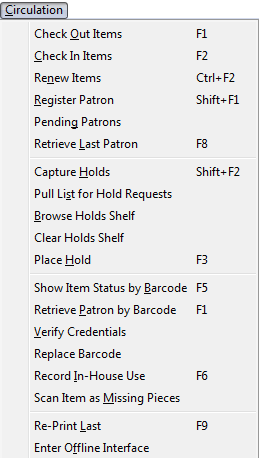
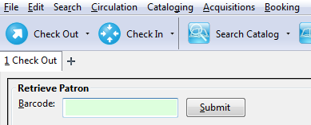
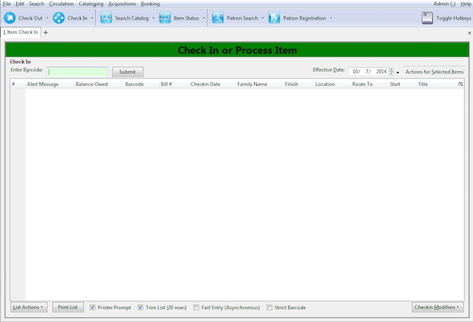
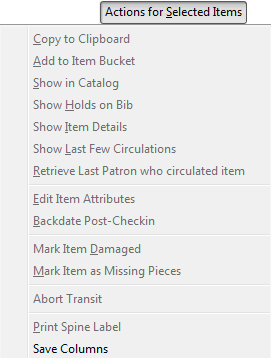
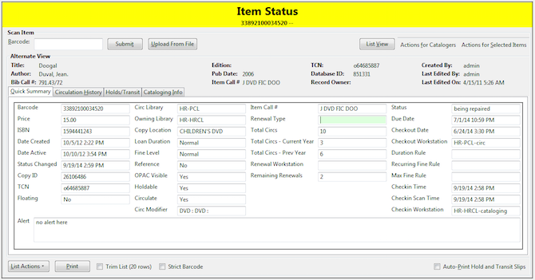

# Circulation Overview

When we talk about the "Circulation" portion of Evergreen, we are talking primarily about the features that roughly correspond to the options available on the "Circulation" menu option of the staff client.

When you go to the "Circulation" section in the top menu of Evergreen, this is what you're looking at:

## Check Out Items

This brings you to the checkout screen where you enter/scan the patron's barcode. If you are scanning in the item, there is no need to hit "Enter" after the barcode is in the field. Most scanners automatically complete that step for you.

Check In Items
--------------

This is the interface where you check in holdings within Evergreen.

* *Enter Barcode*: Where the item barcode gets scanned in.
* *Effective Date*: Where you can manually set the check in time. Useful for when you want to backdate checkins for processing a night drop. The green check in banner will turn red to let you know that the check in date does not match the current one.
* *Actions for Selected Items*: You can use these options after selecting one, or more copies after having being checked in. Note: If you're simply looking to edit a group of items or check their status, it's better to enter the item barcodes in the "Item Status" screen. That way, you will not trigger any transits, hold notices, or other alerts attached to the copies.

> 

- *Copy to Clipboard*: Allows you to copy a field from an item, group of items in the checkin screen. Best for using on single items when you need something numeric like a barcode. The fields will pop up in a window. Click on the field you want to copy. They will look like a website link. There is no confirmation message, but the information is saved to your clipboard and can be pasted.
- *Add to Item Bucket*: See Cataloger Section.
- *Show in Catalog*: Brings up the OPAC entry that you would see as a patron, or after having searched for that item using the search interface.
- *Show Holds on Bib*: Displays the number of holds attached to that record. Not just that particular item, but the record it is attached to. This can include copies from outside of your library.
- *Show Item Details*: Brings up the "Item Status" screen that lists owning/circulating library information, circulation history, hold/transit information if it is captured for a hold or transit, and a read-only view of the MARC record. These is a good section to look to for item troubleshooting when looking for copy location, holdablity , and other information the Sage team can use when looking at misbehaving items.

> 

- *Show Last Few Circulations*: Brings up the last 3 patrons that have checked out that specific title.
- *Retrieve Last Patron who circulated item*: Brings up the last patron's record.
- *Edit Item Attributes*: See Cataloging
- *Backdate Post-Checkin*: When you've checked in an item normally that should have gone been checked in at an earlier date
- *Mark Item Damaged*: Changes Item status to "Damaged". Will not allow it to circulate.
- *Mark Item as Missing Pieces*: Good for when an Audio Book comes back missing a cd, but you still wish to check in the item.
- *Abort Transit*: If you have checked in an item that is getting routed incorrectly for a hold or other purpose. This will cancel the transit to that other library. You will still need to cancel the hold, if that was the reason, however.
- *Print Spine Label*: See Cataloging
- *Save Columns*: Allows you to save the adjustments to the on screen information settings and make them the default for your workstation. These adjustments are made through the column picker:
		
Renew Items
-----------

Similar to the "Check In Items" screen, only tailored for renewing batches of items. This is useful if a patron, or staff member needs items renewed for an amount of time with a specific due date.

Register Patron
---------------

When you wish to add a new patron to the Sage Library System. Make sure that you have checked that the patron is not already in the system (no duplicate patron accounts) or they have simply gone inactive. Search for the patron with "Include inactive patrons?" checked and "Limit results to patrons in" to: Sage Library System.

Pending Patrons
---------------

Not Used in Sage.

Retrieve Last Patron
--------------------

Were you editing/checking out items to a patron and accidentally closed their tab? Select this option to bring back the last active patron tab within Evergreen.

Capture Holds
-------------

While you can use this option, most libraries choose to use the general purpose "Check In" screen to process holds. This allows you to process items, say, from a book drop where not all of them are going to be holds. Some are simply getting put back onto the shelf.

Pull List for Hold Requests
---------------------------

Allows you to see what books other libraries are requesting you to put in transit for a hold or other reason within Sage.

Browse Holds Shelf
------------------

This allows you to see what titles are marked as being on your Hold Shelf.

Clear Holds Shelf
-----------------

An interface to clear holds that have expired off of your hold shelf. You would make sure that the Pickup Library is set to your library, check "View Cearable Holds" and then look at the length of time the holds have been on the shelf. If it has been longer than it should, or the hold needs to be put back into circulation, select one/multiple items and then Select "Clear These Holds" -- this will cancel the hold and send an email (if configured) to the patron whose hold was cancelled
>You still need to check the item back in to reset its status from "On Holds Shelf" and trigger any transits.

Place Hold
----------

Has the same effect as "New Search of the Catalog".

Show Item Status by Barcode
---------------------------

This brings you to the "Item Status" screen as well. Here you can check an item's condition/information/transit hold info.

Retrieve Patron by Barcode
--------------------------

This is the same as clicking the "Check Out" button.

Verify Credentials
------------------

If a patron is unsure of their password, but wants to check with you, you can use this option to enter their user name/barcode or a combination along with their assumed password. You will get a green "Succces testing credentials" return if the password for the account is correct.

Replace Barcode
---------------

This is more of a cataloger option. Replaces the barcode on an item.

Record In-House Use
-------------------

If you have laptops, reference books, or other items that you don't circulate, but would like to record as a statistic, use this interface. These statistics are kept seperate from the general circulation statistics for an item.

Scan Item as Missing Pieces
---------------------------

Will mark an Item as damaged and prompt you to write a note for the missing pieces. When checked the pieces are returned, check the item back in to clear the alerts and make sure the correct pieces have been added to the item.

Re-print Last
-------------

Will reprint the last notice Evergreen produced

Enter Offline Interface
-----------------------

This allows you to check in items and register patrons when connectivity to the Internet/Evergreen has been interrupted.
