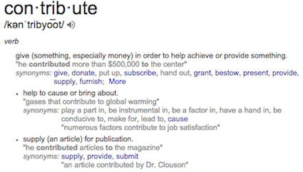

#How to Contribute

Would you like to contribute or feel that the documentation could be improved or built upon?
The source files used for building the repository are in:

- [https://github.com/brentmills/sage_mkdocs](https://github.com/brentmills/sage_mkdocs)

And a live preview site is available at:

- [http://brentmills.github.io](http://brentmills.github.io)

This will change as we move along. I chose the Markdown syntax because it's relatively easy to write and the learning curve is minimal. Basically, write a document how you normally would.

- [Markdown Tutorial](http://markdowntutorial.com/)
- [Markdown Cheatsheet](https://github.com/adam-p/markdown-here/wiki/Markdown-Cheatsheet)
- [Markdown Online Editor (live preview!)](http://dillinger.io/)

Why Markdown instead of some other language?

- We could use Ascidoc, and indeed, the official Evergreen site and a few other Evergreen libraries do just that. Markdown is just a little bit easier and for our scope this will make for easier editing and building of the site. Once changes are made, a quick refresh of the site will upgrade everything.

Suggestions and attachments can also be sent to [my email address](brent@hoodriverlibrary.org).

Thanks!
