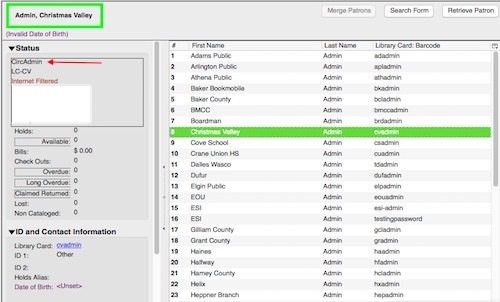
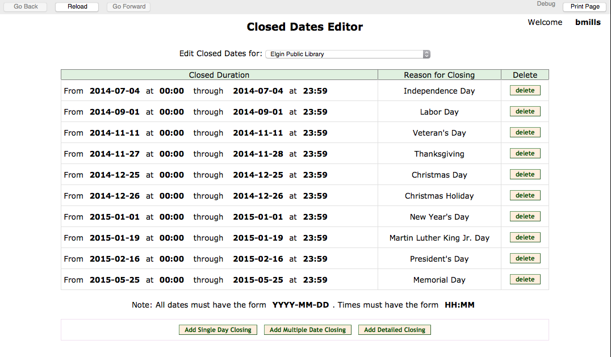

# Administration

## [Reports](http://docs.evergreen-ils.org/2.9/_reports.html)
* Overview, Who can Run them
	- Reports are traditionally run by local administrators or library directors.
* [Folders - How to house your reports and their output](http://docs.evergreen-ils.org/2.9/reporter_folders.html)
* [Running Reports Using Pre-existing Templates](http://docs.evergreen-ils.org/2.9/generating_reports.html)
* [Modifying a Template/Report to Create a Report from Scratch](http://docs.evergreen-ils.org/2.9/reporter_creating_templates.html)
### Reports Training Session (Feb 29, 2016)
* [Session Combined Handouts (pdf)](http://sagelib.org/sites/default/files/documents/Reports_Session-Handout_complete.pdf)
* [Report Slides (Google Slides)](https://docs.google.com/presentation/d/123ydmJ5JRicG5O9bx6NeDuHWtp4Lp7nO-kPb5z0yUh0/edit?usp=sharing)
* [Recorded Go2Meeting (Sage Youtube)](https://youtu.be/Yva6mslVMOk)

## Inventory
* Our Procedure
	
## Staff Accounts
* [Registering New Staff Accounts](http://docs.evergreen-ils.org/2.9/_user_and_group_permissions.html#_staff_accounts)
 
<i class="fa fa-exclamation-circle"></i> Ability to add additional permission group profiles to an account coming in 2.7
 
* Editing Staff Accounts
* [Setting up Working Locations (setting up a workstation)](http://docs.evergreen-ils.org/2.9/_registering_a_workstation.html)

## [Self-Check Module](http://docs.evergreen-ils.org/2.9/_self_checkout.html)
* Staff Portion of Self Check
* Basic Check Out, View Items Out, View Holds, View Fines
* Print Receipts
* Optional Firefox Add-ons

## [Offline Transactions Module](http://docs.evergreen-ils.org/2.9/_offline_transactions.html)
* When to use
* Patron Registration
* Check Out, Check In, Renew
* Uploading Offline Transactions when connection is back

## Editing/Adding Book Cover Jackets
* If you suspect that an item's book jacket image is incorrect in the catalog, first try these steps:
	- Check the 020/024 entries inside the MARC record
	- Are there multiple ISBN entries (020)?
	- Are there multiple UPC entries? (024)?
	- Check if some of the additional ISBN/UPC entries are actually necessary and remove those that you do not need.

 

## Setting Library Hours (and Closed Dates)

There are two locations within the Evergreen client to control which days that the system sees a library as being closed - the Hours of Operation settings and the Closed Dates Editor. These are important for each library system to set and maintain because any day that the library is marked is closed will not generate fines for the library's patrons and the library's books will not be targeted for holds. 

If you need assistance in retroactively voiding fines for the day, please enter a [Help Desk ticket](https://sagelib.org/support) with the details.

### How to Set Library Hours

If your library changes which days of the week it is open, enter a Help Desk ticket and the Sage staff will update this setting for you.

### How to Set Library Closed Dates

*Please note - a 'Closed Date' should only be used for days that the library is entirely closed and overdue fines should not be applied.*

* Log in as a Local Admin (any account that has CircAdmin as its permission group).

* Click on the top admin menu (upper right) and select: *Admin > Local Administration > Closed Dates Editor*.
* Select the relevant library location from the drop-down list.
* At the bottom of the page, click on one of the options:
	* Add Single Day Closing 
	* Add Multiple Date Closing
	* Add Detailed Closing
* *Note*: Use Multiple Date Closing if you have a consecutive number of dates you'll be closed. Say, December 24-26th. Do not choose "Add Single Day Closing" for each individual day.
* *Note*: "Add Detailed Closing Date" -- unless you are closing for a few hours or opening at at entirely different time it's usually best to use the prior two options. A small form will open - fill out the details. You may check the 'Apply to all of my libraries' box to close all branches in your library system at once. Click the Save button.
 

Video Overview of Multiple Day Closing Creation/Deletion --> <https://youtu.be/_lSn7C3uMG4> (Sage Specific)