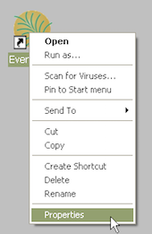
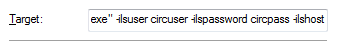
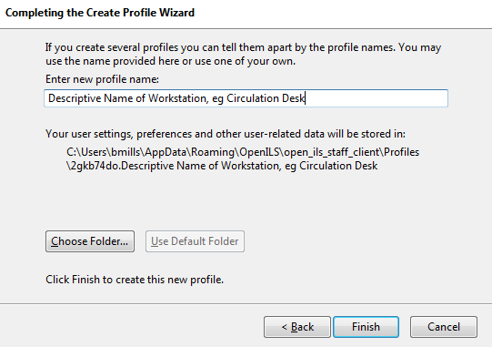
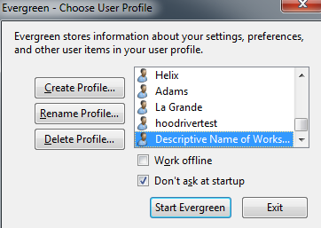
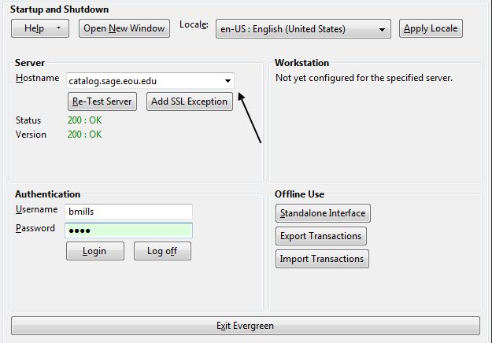
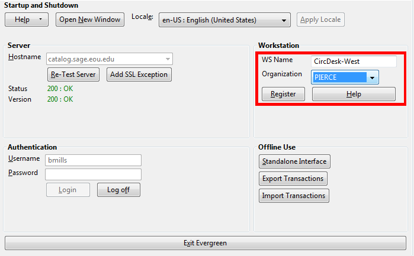
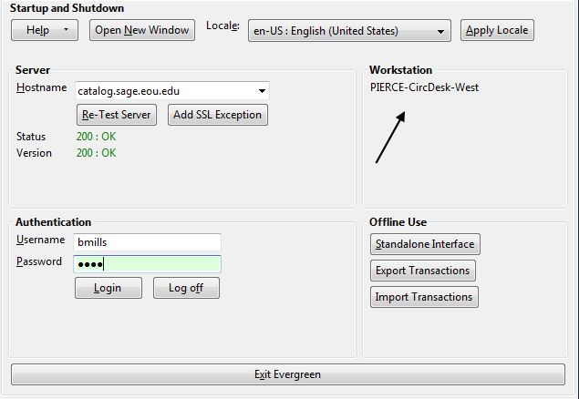

# Getting Started

## Logging in to Evergreen

- Select the _Locale_ to match your language preference.  
- Enter the _Hostname_ of the Evergreen server you are connecting.
	- Main `catalog.sage.eou.edu` 
	- Test `sage.eou.edu`
- Click _Test Server_ to ensure that you are able to reach the server.  You should see `200 : OK` indicated in green for _Status_ and _Version_.  

If **Status** indicates `There was an error testing this server`, check for a typo in the **Hostname** field. The hostname should read: `catalog.sage.eou.edu`.

If **Version** indicates `404 Not Found`, the server does not support the version
of your staff client. You will need to download the correct version of Evergreen (currently 2.5.1) from 

- Enter your **Username** and **Password**  and  click **Login**.
- If this is the first time you login from the workstation, you will need to [register your workstation](#setting-up-a-workstation). 

## Auto Login

To use auto login, you will need to modify the *Evergreen shortcut* on your desktop. There are three new commands which are necessary for automatic login:

>- -ilsuser
>- -ilspassword
>- -ilshost

You will need all three to have your client successfully login. To enable
automatic login we need to modify the Evergreen shortcut on your desktop. If
your shortcut already has preset tab commands, then place the automatic login
commands after those commands. 

- First, if your workstation will have multiple logins (circ, cat, admin) you need to copy a shortcut for each. There are a couple of ways to do this.
- Right-mouse click and drag icon; upon release select *Create Shortcut Here*. 

- Right-mouse click icon, select *Send to*, and select *Desktop (create shortcut)*.

- Right-mouse click the new shortcut and select *Properties*.

Listed in the *Target* box you will see something like the following path surrounded by quotation marks: "C:\Program Files\Evergreen Staff Client Sage\evergreen.exe"

- Place your cursor after the ending quotation mark and enter a space after the last quotation mark.

- After the space enter the login code for username followed by a space and the username
>ilsuser circuser
- Enter a space and then the login code for password followed by the password
>ilspassword circpass
- Finally, enter the login code for host followed by a space and the host address (this is the exact address which shows up in the Server Hostname box when you manually login to the client.
>ilshost catalog.sage.eou.edu

## Logging Out

There are several ways to end your Evergreen staff client session:

* Click the *Exit Evergreen* button on the bottom of the login page.
* Click the *x* at the top left of the *login* window.
* Choose *File -> Quit Program* from the menu of the application window.

Clicking the *x* on the application window (not the login window) will not exit Evergreen, but only close the window.
A new application window can be opened by clicking _Open New Window_ from the login window.

## Setting up a Workstation

Workstations are what Evergreen uses to determine which library your machine is pulling settings from. This is important for running reports, setting the self-check’s location, checking in items and assigning fines to patrons. If you are on circulation at PIERCE, both your login account and workstation should be set to PIERCE.

When first logging into Evergreen on a new staff client, you will be prompted to create a workstation:

Create a descriptive name for the workstation and continue on with “Start Evergreen”. Uncheck “Don’t ask at startup” if you have [multiple workstations](http://pines.georgialibraries.org/workstation-profiles) you’re configuring for a single machine:

Enter the server address `catalog.sage.eou.edu` and login with your account credentials:

Choose a workstation name for the machine and the library (organization) you want it connected to. Then click “Register”:

You are now set up to do work connected to that library. Check the workstation name to ensure you’re logged in as the right library:

- Configuring Receipt Templates
- Configuring Receipt Printers
- [Cheat Sheet For Sage Evergreen](http://sagelibraries.wikispaces.com/file/detail/Sage_Evergreen_Cheat_Sheet.pdf)