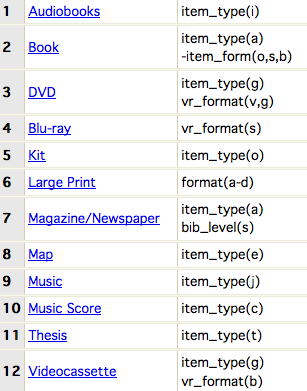
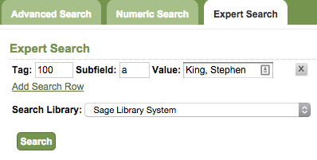
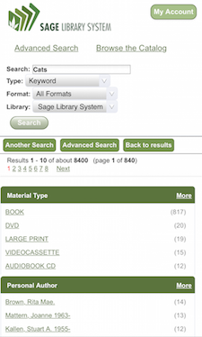

#OPAC

### What is an OPAC?

* OPAC is short for the <b>Online Public Access Catalog</b> or, what patrons see when they visit <http://catalog.sage.eou.edu>. It is an online, searchable directory of all of the resources held within Sage. You can search the OPAC to locate books/electronic resources/magazines/and other items that have been loaded into Evergreen. This is the primary access point for patrons.  
* When talking to Sage Support Staff and reporting problems a shorthand to remember is: What patrons see: <i>OPAC</i>; What staff see when logged into their workstations: <i>Staff Client</i>.

## Types of Searching

### General / Basic Search

* This is the most often used type of searching within Evergreen. Simply entering a query (generally a keyword) into the search box on <http://catalog.sage.eou.edu> and clicking "Search". You can use limiters to be more specific here as well:
    * <b>Type</b>: Keyword, Title, Magazine, Author, Subject, Series, Bib Call Number. Note: The Bib Call Number option is <i>not</i> the same as a normal call number search (Advanced Search > Numeric Search > Field: Call Number (Shelf Browse). It is for the call number attached to the larger bibliographic record, not the volume call number that is created by Sage catalogers.
    * <b>Format</b>: This can limit results by records that meet a certain requirement through their MARC encoding.
		
    * <b>Library</b>: You can search by individual branch, eg "Baker County Library" or district/system: eg "Baker County Library District" or the entire consortium: eg "Sage Library System".

### Advanced Search Options

* This screen will look the same for the OPAC as well as the Staff Client. There are options for: <i>Advanced Search, Numeric Search and Expert Search</i>.

<b>Advanced Search</b>

* <i>Search Input</i> allows you to specify two additional levels of the search filtering you could do at the General/Basic search level. <i>Search Filters</i> allow you to limit by those "Item Type" options (called "Format" on the basic search screen). As well as <Language> and <i>Search Library</i>. You can also limit the topics by available items and Publication Year.
		
<b>Numeric Search</b>

* This screen will allow you to search more granularly for titles by ISBN, ISSN, Bib Call Number, Call Number (use this one), Library of Congress Control Number (LCCN), Title Control Number (TCN) or Item Barcode. The most valuable options in this interface are the <b>Item Barcode</b> and <b>ISBN</b> options, in my opinion. You can also limit by the <i>Search Library</i>. I would recommend leaving this at the top level: Sage Library System, to increase your chance of retrieving the correct title.

<b>Expert Search</b>

* I like to refer to this as the "Cataloger's Search". Here you can search for a title/set of titles by its MARC tags, subfields and values. For instance, if you wanted to see all of the titles that had a 100 field entry for Stephen King, you could use:

		| Tag = 100 | Subfield = a | Value = King, Stephen |

## Using "My Account"

## Mobile OPAC

* Our Evergreen installation is optimized with a responsive design for mobile devices as well. A patron can search, place holds and renew items -- all through their mobile device

