<center>
# Installing the Evergreen Client
</center>
<hr size=2>

* Windows 7/8/10 (Windows XP will work, but it isn't recomended for security reasons)
* Mac OS X
* Linux

### Windows 7/8/10

* Open up Firefox/Chrome and go to <http://catalog.sage.eou.edu/updates/manualupdate.html>

..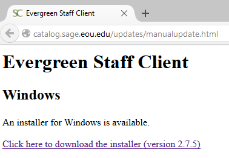

* Click on the Windows staff client link:

..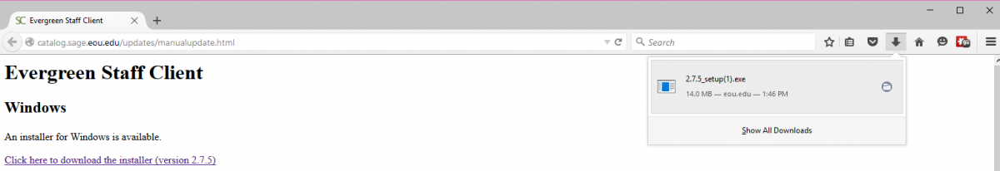

* Open up the directory where the installer was downloaded:

..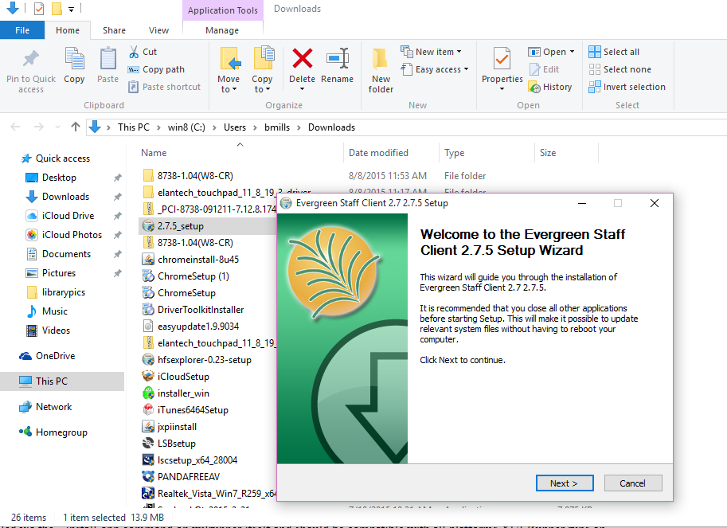

* Open the installer setup file

..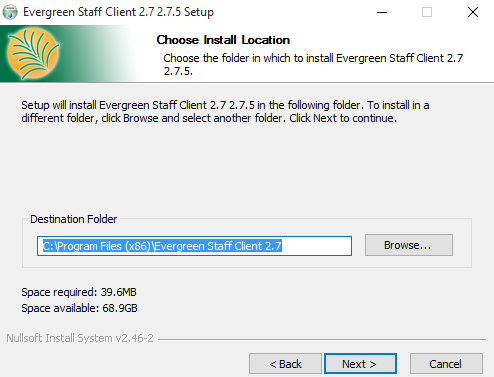

* Accept the defaults for the installer and notice where it was downloaded to (C:\Program Files (x86)\....)

..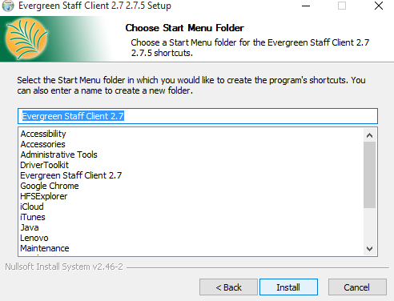
..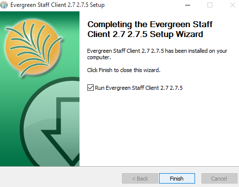

* Login with the hostname: `catalog.sage.eou.edu` If you haven't created a workstation--or this is a new computer--you'll do that at this step as well


### Mac OS X

* Open up Firefox/Chrome and go to <http://catalog.sage.eou.edu/updates/manualupdate.html>
* Click on the download link for the OS X staff client

..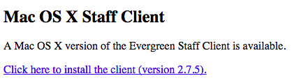

* Wait for the download to finish and then open up the .dmg file so that you see this screen

..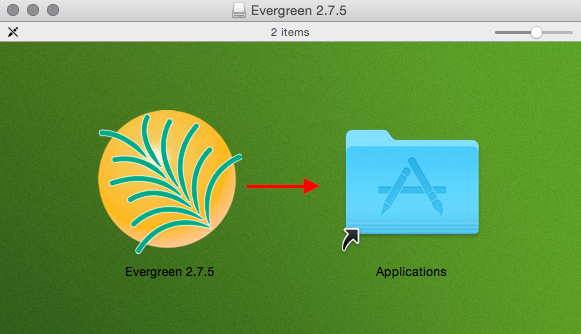

* Drag the Evergreen icon/app into the Applications folder link. This will copy it to the Applications folder (/home/username/Applications) on your computer Open up the staff client and double check that everything is all right. Enter: catalog.sage.eou.edu for the hostname and create a workstation if you have not already, or this is a new computer setup

..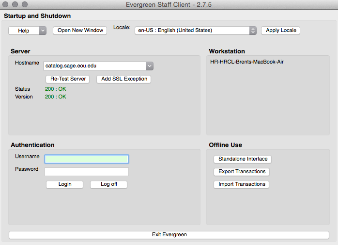


### Linux

* Open up Firefox/Chromium/Ice Weasel and go to: <http://catalog.sage.eou.edu/updates/manualupdates.html>
* Click on the Linux (64 bit) staff client download link

..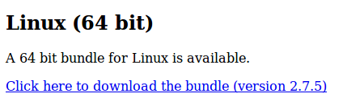

* After the compressed staff client is downloaded, open it with Archive Manager

..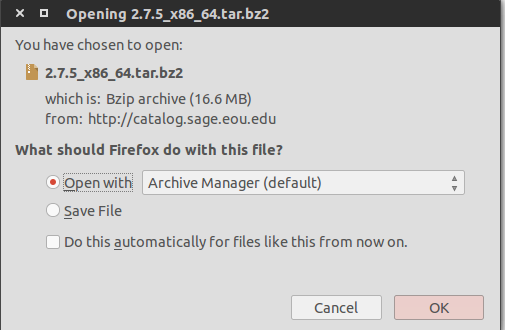

* After opening the file with Archive Manager, you should be presented with a window like this, click "Extract"

..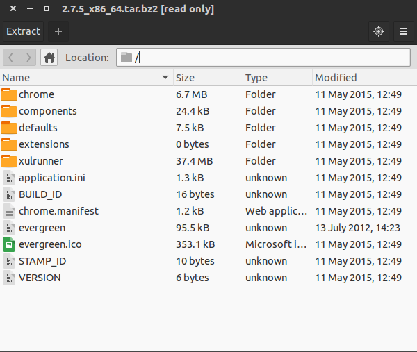

* Extract the files to somewhere you can find them. Since it defaults to your home folder, I created a folder called "Applications" to extract the files to. You can create one called "evergreen" or whatever you would like as well. Click "Extract" again to unpack the files into that folder you have selected and/or created.

..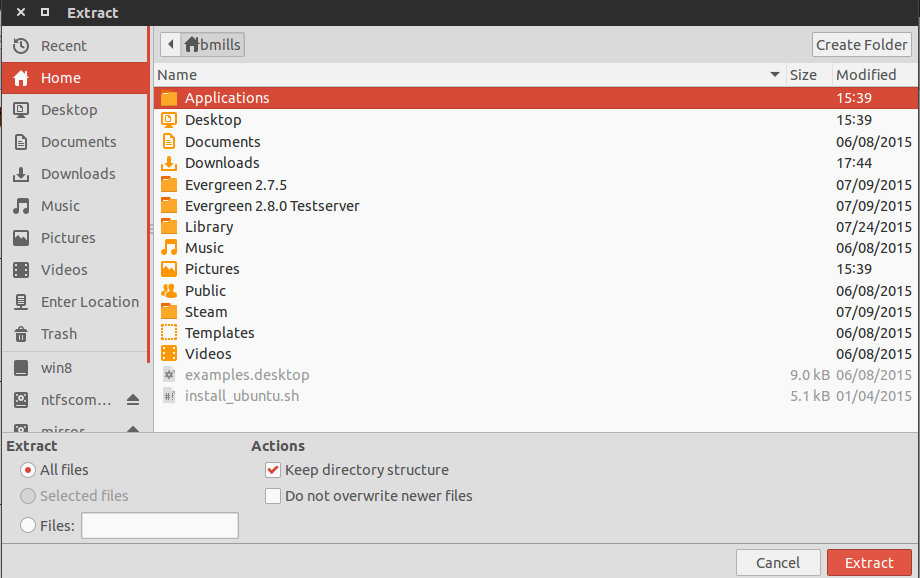

* You should see a message like this. Click "Show me the files"

..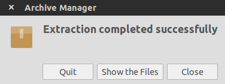

NOTE: If you're using a different distribution like Mint that has a launcher built into the right click menu, [go here](https://sagelib.org/node/270). Otherwise, if you're using generic Ubuntu (Unity) proceed ahead or download the gnome-panel using apt and run the following to create a desktop link (will need sudo access). Open a terminal window and run:

`sudo apt-get install --no-install-recommends gnome-panel`

and then:

`gnome-desktop-item-edit --create-new ~/Desktop`

* This will bring you to the base installation directory. You can now click on the "evergreen" file and it will launch the staff client. However, we are going to create a desktop link with an icon so that it's easier to launch without finding the folder.

..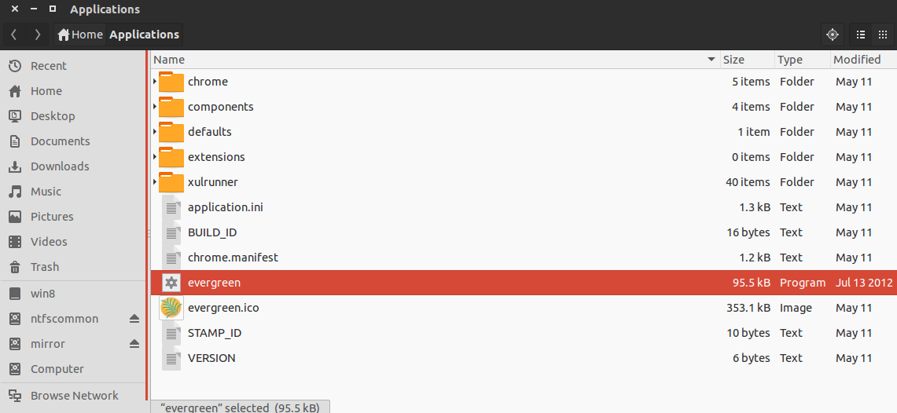

* Right click on the "evergreen" file within the folder and make a note of its location. It's `/home/bmills/Applications/evergreen` for our example.

..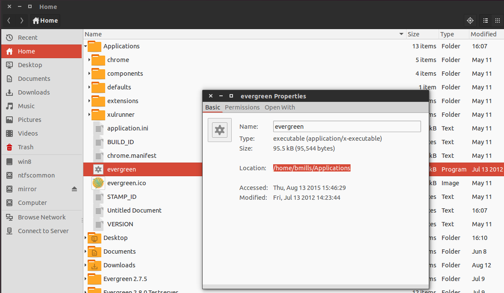

* Navigate to the desktop and create an empty file by "Right Click --> New Document --> Empty Document". Leave it titled "Untitled Document" for now.

..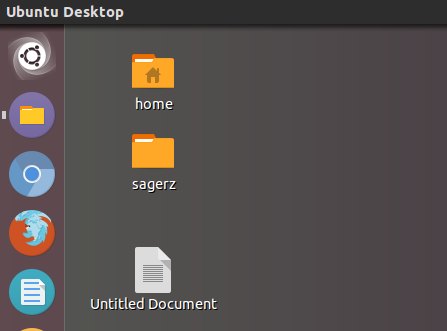

* Open up the "Untitled Document" with a text editor and insert this inside. Replacing my locations with the ones appropriate to your computer and your Evergreen folder. Click "Save" after you have entered the following in the text file:

```
#!/usr/bin/env xdg-open
[Desktop Entry]
Version=1.0
Type=Application
Terminal=false
Exec=/home/bmills/Applications/evergreen
Name=Evergreen 2.7.5
Comment=desktop link
Icon=/home/bmills/Applications/evergreen.ico
```

..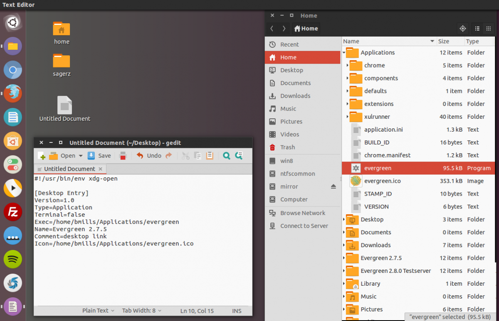

* Right click on the "Untitled Document" and select "Properties". Change the name of the document to "evergreen.desktop"

..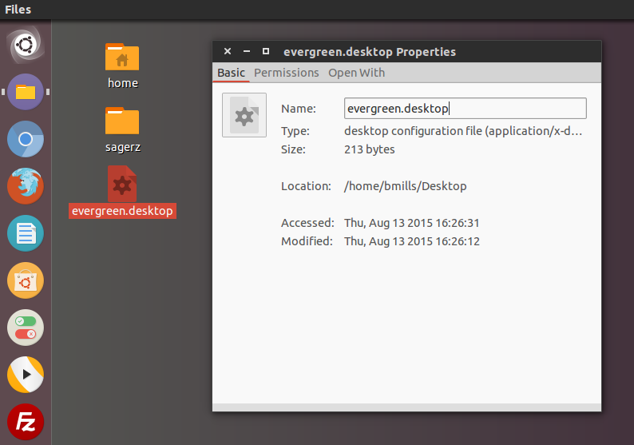

* Then Click on the "Permissions" tab and check the "Execute" box to enable the program to launch. The icon and launcher's name should change. You can now double click the link on the desktop to launch your staff client.

..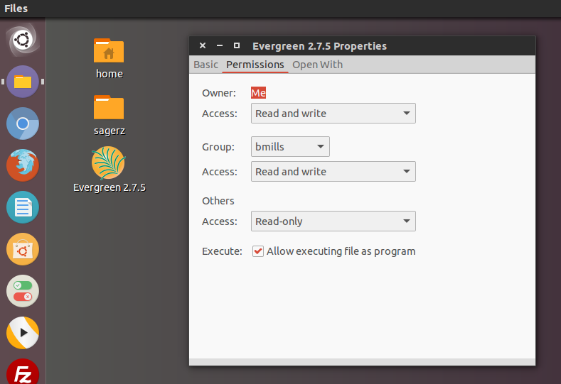


