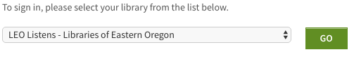

# Frequently Asked Questions (FAQ)

###Account

#### Can I request a library card online?

Not yet! but we're working with our members to hopefully have this functionality built-in for some of our libraries in the future. For now, you'll have to visit your local library in person to start the process of getting a library card. You can also search for your local library by clicking on the "Members" tab above.

#### Can I renew my books online?

Yes. Once you have received a library card, you automatically have an online account for the catalog. If you have done nothing on your own, you login will be your library card number and your password will be the last four digits of your phone number (entered at time of registering for a card). Once you have that information, head over to your checkout information page and you can renew most titles twice.

#### Can I receive books from a library that isn't my main library?

Yes. Clicking on the "Place Hold" link in the search results screen or in the item record will grab the closest copy from one of the Sage Member Libraries. If you need to get a specific copy from one library, talk to your library staff member who can perform different types of holds for you.

#### What sort of special things can I do with my online library account?

* Login to your account to do so many cool things! The main advantages of using your online library account include:
* Info at a glance (when does my account expire? how many books to I have checked out? what's my fine balance?)
* Creating Reading Lists
* Access to a log of your previous checkouts and/or holds
* Renewal of items
* Hold Management
* Access to personalized messages from your library
* Change your username, password or email
* Set notification preferences (email? text? phone number?)
* Fine tune and personalize your search results
* Access ebooks and e-audiobooks from Library2Go

#### What do I get access to by being a Sage library user?

* You get to tap into the collections of our 80+ member libraries by being a member of one.
* Access to Library2Go (ebooks, e-audiobooks)

### Problems

#### I'm trying to login to Library2Go but I keep getting a "Account Expired" error!

There are a couple things that could be happening here:

* Is your account expired?
* You can check by logging into your account online or calling your local library
* Did you mistype your login/password?
* Do you have a password manager automatically fill in your login and password?
* Check that the values are correct.
* Do you have a large number of fines and/or overdues?
* Have a large number of fines or lost items can affect your elligibility for certain services including Library2Go. Check your fine balance online or call your local library to find out.

#### Ugh! I can't get into my account online! What can I do?

* Have you tried logging in by clicking the "My Account" button in the top right hand corner of the catalog? You can also just click this link to bring you to the prompt screen.
* Forgot your password? You can click the "Forgot my password" link underneath the password section of your account. Or just click here. You will need to have a valid email address in your account for this to work.

#### I'll be going on vacation and won't be able to return my books on their due date. What can I do?

* Renew your books online by logging into your account online and clicking on the "Items Checked Out" tab
* Call your local library to renew your items

#### Where do I return my books?

You can return your materials at any Sage member library location. Please do not return Sage member library materials at a location outside of our network (Portland, Vancouver).

### Searching

#### It doesn't seem like there are many books available when there should be. Am I searching correctly?

Make sure that you have "Sage Library System" selected in the dropdown menu for "Library". If you have set the search preferences in your My Account or are searching the catalog within your home library, this could be searching only your home library's items.

### The Catalog

#### What is this library catalog? It doesn't look like the one at my previous library...

Sage proudly uses Evergreen as its catalog software. In the spirit of open-access, the software is free and open-sourced. You can see the nuts and bolts of Evergreen by visiting the project's Git repository. You can also have a look at what we're sharing on our Sage GitHub repository. E-books and Downloadable Audiobooks

#### How do I download electronic ebooks and audiobooks?

Go to the Library2Go website by clicking on the "Library2Go" button on the top of the catalog. Then you will choose the "LEO Listens - Libraries of Eastern Oregon" library and select "Go". Then you will login with your library barcode and password.

#### How do I find out more information?

Visit their Support Page for information on downloading titles to your Kindle/iOS/Android device.

#### How many items can I check out and put on hold at once?

You can check out and put on hold up to 6 items at one time.
#### How long can I check out the items?

You can set your lending period to either 7,14 or 21 days for both audiobook and e-book downloads. After that time period your checkouts will expire from your account.

### Requests

#### How do I request a book order for my library?

Use the Item Purchase Request Form for Sage or your home library (when available).